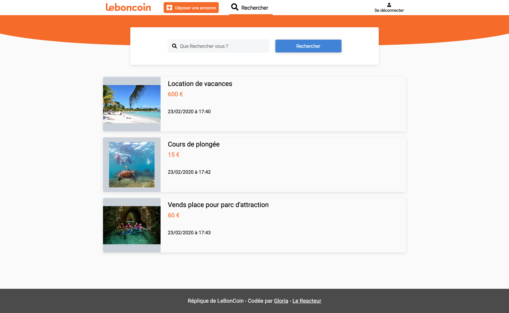

# LeBonCoin clone front-end

## Description

This project is an online ads front end. You can view ads, click on ads and view the description, price, pictures. You can create a personal account, login with your account and logout. You can also publish ad if you are login, and buy article.

Desktop version only.

To do : responsive and searches with the search bar.

## Installation

To clone this project : https://github.com/gloluz/online-ads-frontend.git

## Read

To read this project:

`yarn start`

Or with this link : [https://replique-leboncoin.netlify.app]

## Contributing

To contributing please refer to the [CONTRIBUTING.MD](CONTRIBUTING.MD)

## License

[LICENSE MIT](LICENSE)
